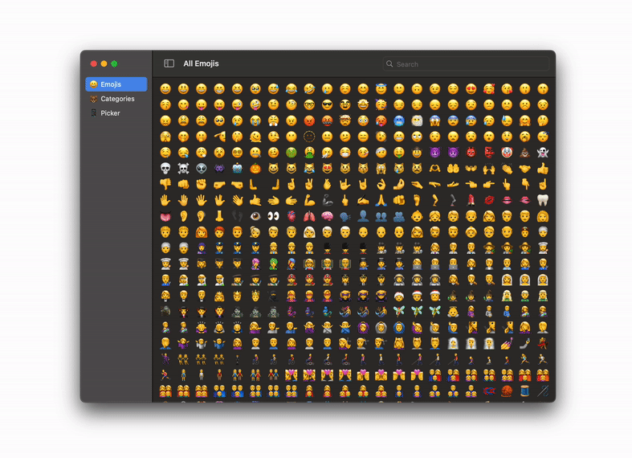

<p align="center">
    
</p>

<p align="center">
    
    
    <a href="https://twitter.com/kankodahq"></a>
    <a href="https://mastodon.social/@kankoda"></a>
</p>


## About EmojiKit

EmojiKit is a Swift SDK that lets you use emojis and other emoji-based features on all major Apple platforms (iOS, macOS, tvOS, watchOS & visionOS).

<p align="center">
    
</p>

EmojiKit provides you with all you need to work with emojis, including emoji models, standard categories, support for localization & skin tones, unicode & version information, etc.


## Installation

EmojiKit can be installed with the Swift Package Manager:

```
https://github.com/Kankoda/EmojiKit.git
```


## Features

EmojiKit provides a bunch of emoji-specific features:

* 😀 [Emojis][Emoji] - EmojiKit defines a structured emoji model.
* 🐻 [Categories][EmojiCategory] - EmojiKit defines all standard emoji categories.
* 📦 [Version Info][EmojiVersion] - EmojiKit defines all emoji versions and their emojis.
* 🇸🇪 [Localization][Localization] - EmojiKit supports localizing all emojis and categories.
* 👍🏾 [Skin Tones][SkinTones] - EmojiKit provides skin tone information for all emojis that support it.


## Getting started

The [online documentation][Documentation] has a [getting-started guide][Getting-Started] that helps you get started.


## Documentation

The [online documentation][Documentation] has more information, articles, code examples, etc. 


## Sponsor my work

You can [sponsor this project][Sponsors] on GitHub Sponsors, [reach out][Email] for paid support, or sign up for a commercial license to help support this project. Your support makes it possible to put more work into this project.


## Contact

Feel free to reach out if you have any questions or need help any way:

* Website: [kankoda.com/emojikit][Website]
* Mastodon: [@kankoda@mastodon.social][Mastodon]
* Twitter: [@kankodahq][Twitter]
* E-mail: [info@kankoda.com][Email]


## License

EmojiKit is available under the MIT license. See the [LICENSE][License] file for more info.


[Email]: mailto:info@kankoda.com
[Website]: https://kankoda.com/emojikit
[Twitter]: https://twitter.com/kankodahq
[Mastodon]: https://mastodon.social/@kankoda
[Sponsors]: https://github.com/sponsors/danielsaidi

[Documentation]: https://kankoda.github.io/EmojiKit/documentation/emojikit/

[Getting-Started]: https://kankoda.github.io/EmojiKit/documentation/emojikit/getting-started

[Emoji]: https://kankoda.github.io/EmojiKit/documentation/emojikit/emoji-article
[EmojiCategory]: https://kankoda.github.io/EmojiKit/documentation/emojikit/emojicategory-article
[EmojiVersion]: https://kankoda.github.io/EmojiKit/documentation/emojikit/emojiversion-article
[Extensions]: https://kankoda.github.io/EmojiKit/documentation/emojikit/extension-article
[Localization]: https://kankoda.github.io/EmojiKit/documentation/emojikit/localization-article
[SkinTones]: https://kankoda.github.io/EmojiKit/documentation/emojikit/skintones-article

[License]: https://github.com/EmojiKit/EmojiKit/blob/main/LICENSE
